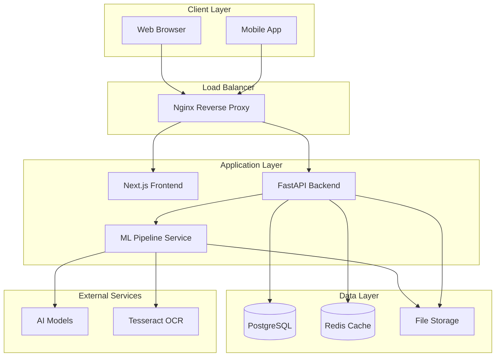

# System Overview

## Architecture Diagram

## Component Overview

### Frontend (Next.js)
- **Purpose**: User interface for uploading and viewing medical reports
- **Technology**: Next.js 14, React, Tailwind CSS, TypeScript
- **Features**:
  - Responsive design with dark/green theme
  - Drag & drop file upload
  - Real-time status updates
  - Report visualization and analysis display

### Backend (FastAPI)
- **Purpose**: RESTful API for medical report management
- **Technology**: FastAPI, SQLAlchemy, PostgreSQL, Redis
- **Features**:
  - User authentication and authorization
  - File upload and processing
  - Database operations
  - API endpoints for frontend integration

### ML Pipeline
- **Purpose**: OCR and AI processing of medical documents
- **Technology**: Python, Transformers, PyTorch, Tesseract
- **Features**:
  - OCR text extraction from images
  - Medical entity recognition
  - Document classification
  - Risk assessment and analysis

### Database (PostgreSQL)
- **Purpose**: Persistent storage for users, reports, and metadata
- **Features**:
  - User management
  - Report metadata storage
  - Full-text search capabilities
  - Data integrity and relationships

### Cache (Redis)
- **Purpose**: Session management and caching
- **Features**:
  - User session storage
  - API response caching
  - Rate limiting
  - Background job queues

## Data Flow

1. **Upload Process**:
   - User uploads medical report image via frontend
   - File is sent to backend API
   - Backend stores file and creates database record
   - ML pipeline processes the image for OCR
   - AI models extract medical entities and classify document
   - Results are stored in database and returned to frontend

2. **Viewing Process**:
   - User requests report list from frontend
   - Frontend calls backend API
   - Backend queries database and returns report data
   - Frontend displays reports with analysis results

3. **Search Process**:
   - User searches for specific reports
   - Backend performs full-text search on OCR text
   - Results are filtered and returned to frontend

## Security Considerations

- **Authentication**: JWT-based authentication with secure tokens
- **Authorization**: Role-based access control for different user types
- **Data Encryption**: Sensitive data encrypted at rest and in transit
- **File Security**: Uploaded files scanned and validated
- **API Security**: Rate limiting, CORS, and input validation
- **Database Security**: Connection encryption and access controls

## Scalability Features

- **Horizontal Scaling**: Stateless services can be scaled horizontally
- **Load Balancing**: Nginx distributes traffic across multiple instances
- **Caching**: Redis reduces database load and improves response times
- **Async Processing**: ML pipeline processes files asynchronously
- **Database Optimization**: Indexed queries and connection pooling

## Monitoring and Observability

- **Health Checks**: All services have health check endpoints
- **Logging**: Structured logging across all components
- **Metrics**: Performance and usage metrics collection
- **Error Tracking**: Centralized error reporting and alerting
- **Uptime Monitoring**: Service availability monitoring
